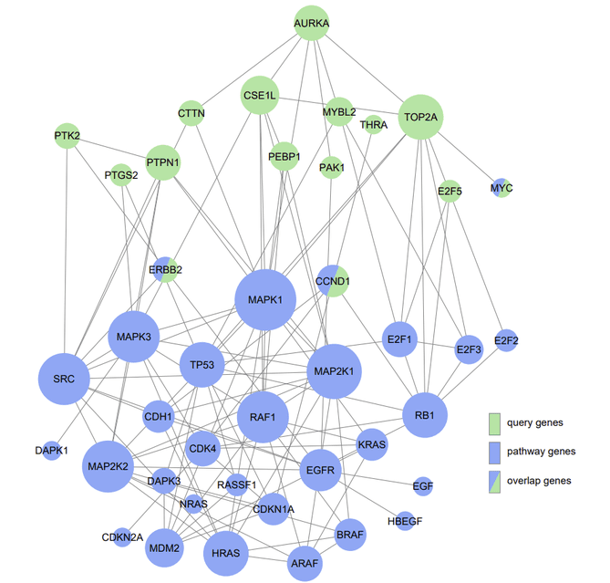

# **ANUBIX**

<p align="center">
  
</p>

**ANUBIX** is a genome-wide network analysis tool for pathway enrichment analysis. It is based on random sampling to build the expected crosstalk distribution between a query gene set and a pathway. The statistical significance is then assessed using a beta-binomial distribution.

For a detailed explanation of **ANUBIX** and its applications, please refer to the [ANUBIX paper](https://pubmed.ncbi.nlm.nih.gov/32788619/).

You can also explore ANUBIX and the clustering implementation in our website called [PathBIX](https://pathbix.sbc.su.se/)

Also check the **ANUBIX_manual** for detailed instructions.

### **Important Notes**
- **`anubix_links()`** function needs to be run before any other operations.
- **ANUBIX** is designed specifically for processing **undirected** networks.
- We recommend using the newest **`anubix_constrained`** function instead of **`anubix`** to obtain more sensitive and comprehensive results.

## **Getting Started**

### **Installation**

To install **ANUBIX** from GitHub, use the following R code:

```r
# Install devtools or remotes if not already installed
install.packages("devtools")  # or install.packages("remotes")

# Install the ANUBIX package from GitHub
devtools::install_github("MiguelCastresana/anubix")  # or remotes::install_github("MiguelCastresana/anubix")

# Load the package
library(anubix)
```

### **Package content**
1. **anubix_links**: Computation of all the links that each gene in the network has to each of the pathways.

2. **anubix**: Computes ANUBIX, an accurate test for network enrichment analysis between query sets and pathway sets. Instead of normal random sampling it does constrained random sampling, taking the
degree of the nodes into account.

3. **anubix_transitivity**: Same than **anubix** but additionally, it takes into account the gene set´s transitivity (a measure of the tendency of the nodes to cluster together) to
compute enrichment.

4. **anubix_clustering**: Clusters the gene set using Infomap (a method that uses information theory to cluster genes into modules) and then applies ANUBIX.


### **Analysis**
1. **TP_analysis.R**: Performs true‑positive benchmarking by splitting KEGG and REACTOME pathways into two halves.

2. **FP_analysis.R**: Performs false‑positive benchmarking by generating random genesets and performing pathway enrichment analysis in KEGG or REACTOME databases.

3. **stability_analysis.R**: Empirically benchmark a MSigDB gene set against KEGG pathways using ANUBIX, deriving p-value confidence intervals and determining sample size for CV≤0.02 convergence.

4. **fraction_intralinks.R**: Computes KEGG‐pathway mixing parameters in the FunCoup network (fraction of edges leaving each pathway), correlates them with BinoX FPR, and produces a log‐scaled scatterplot.


**Contact**:  
Miguel Castresana Aguirre ([miguel.castresana.aguirre@ki.se](mailto:miguel.castresana.aguirre@ki.se))

